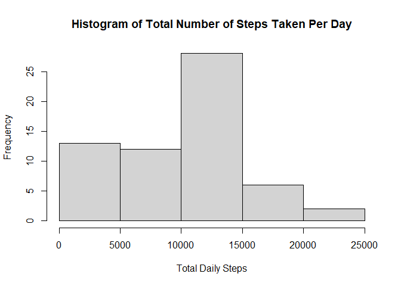
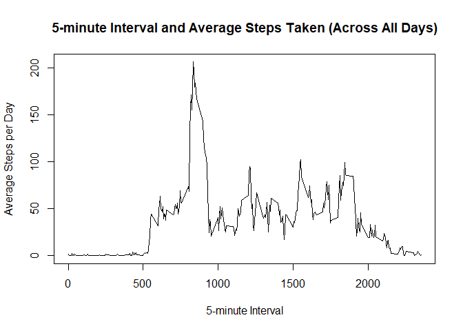
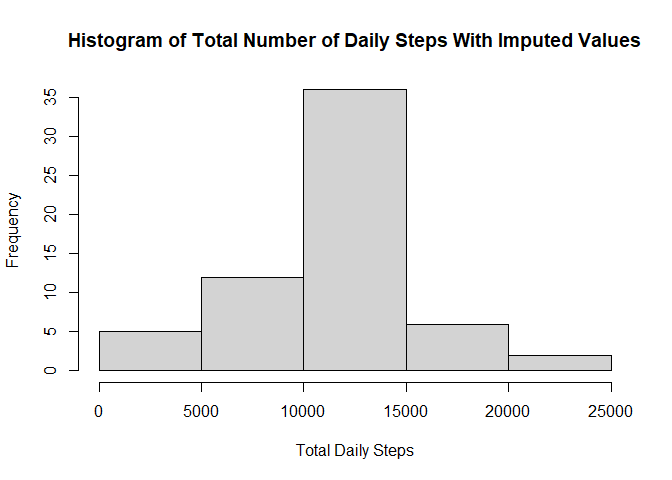
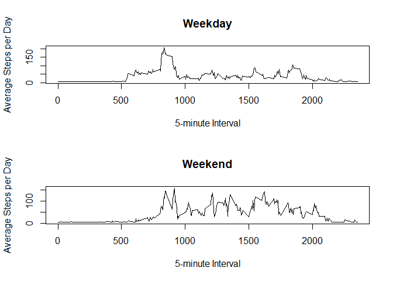

## Loading and preprocessing the data
The data downloaded from Coursera Assignment Page [Activity Data]{https://d396qusza40orc.cloudfront.net/repdata%2Fdata%2Factivity.zip} on February 27, 2021 at 7:03 EST.

This loads the data from a zip file that does not need preprocessing.  

```r
data <- read.csv(unz("repdata_data_activity.zip", "activity.csv"), header=TRUE, na.strings = "NA") #This reads the file within a zip folder, pulls variable names form the header, and converts the "NA" text to missing values
```


## What is mean total number of steps taken per day?

First, we will get the total number of steps taken per day (ignoring missing values):  

```r
total_steps_day<-aggregate(data$steps, by=list(date=data$date), FUN=sum, na.rm=TRUE)
```

Here is a histogram for the total number of steps taken per day:

```r
hist(total_steps_day$x,xlab="Total Daily Steps",main="Histogram of Total Number of Steps Taken Per Day")
```

<!-- -->

I will not calculate the mean and median of the total number of steps taken per day:

```r
mean(total_steps_day$x, na.rm=TRUE)
```

```
## [1] 9354.23
```

```r
median(total_steps_day$x, na.rm=TRUE)
```

```
## [1] 10395
```
From the output we have a mean of 9354.23 steps per day and median of 10,395 steps per day. Please note that this is because the missing values are removed/ignored.
  
## What is the average daily activity pattern?

Per the assignment, I will make a time series plot of the 5-minute interval and average number of steps taken (across all days).  
First I must average the steps per day and then I create the plot

```r
avg_daily_act<-aggregate(data$steps, by=list(interval=data$interval), FUN=mean,na.rm=TRUE)
plot(avg_daily_act$interval,avg_daily_act$x,type="l",xlab="5-minute Interval",ylab="Average Steps per Day",main="5-minute Interval and Average Steps Taken (Across All Days)")
```

<!-- -->


Next I will find which 5-minute interval contains the maximum number of steps:


```r
avg_daily_act$interval[which(avg_daily_act$x==max(avg_daily_act$x))]
```

```
## [1] 835
```

```r
max(avg_daily_act$x)
```

```
## [1] 206.1698
```
From the output, we see that the 835 (5-minute window), i.e. 8:35 AM, has the maximum number of 206 steps  


## Imputing missing values
First, we need to find the total number of missing values, NA, in the data set:

```r
summary(data)
```

```
##      steps            date              interval     
##  Min.   :  0.00   Length:17568       Min.   :   0.0  
##  1st Qu.:  0.00   Class :character   1st Qu.: 588.8  
##  Median :  0.00   Mode  :character   Median :1177.5  
##  Mean   : 37.38                      Mean   :1177.5  
##  3rd Qu.: 12.00                      3rd Qu.:1766.2  
##  Max.   :806.00                      Max.   :2355.0  
##  NA's   :2304
```

From the output, we see that only Steps has missing values with a total count of 2,304 missling values.

I will now create a new dataset with the missing values repalced by the mean number of steps using the impute function (requires the package "Hmisc")

```r
library(Hmisc) #Get the library for impute function
```

```
## Warning: package 'Hmisc' was built under R version 4.0.3
```

```
## Loading required package: lattice
```

```
## Loading required package: survival
```

```
## Loading required package: Formula
```

```
## Warning: package 'Formula' was built under R version 4.0.3
```

```
## Loading required package: ggplot2
```

```
## 
## Attaching package: 'Hmisc'
```

```
## The following objects are masked from 'package:base':
## 
##     format.pval, units
```

```r
data2<-data # Copy dataset into a new one
data2$steps<-impute(data2$steps,mean) # Replace missing values with mean steps
```

Next, I will calcuate the new total number of steps per day, plot a histogram, and calculate the mean and median of this new data set.

```r
total_steps_day2<-aggregate(data2$steps, by=list(date=data2$date), FUN=sum)
hist(total_steps_day2$x,xlab="Total Daily Steps",main="Histogram of Total Number of Daily Steps With Imputed Values")
```

<!-- -->

```r
mean(total_steps_day2$x)
```

```
## [1] 10766.19
```

```r
median(total_steps_day2$x)
```

```
## [1] 10766.19
```
From the output we see that there is a mean of 10,766.19 steps per day as well as a median of 10766.19 steps per day. These values are both larger than the estimates we made before imputing the missing data.  

## Are there differences in activity patterns between weekdays and weekends?

Here is a panel plot to comparing Weekday versus Weekend for the average steps per day across the 5-minute intervals:  

```r
data2$day<-factor(weekdays(as.POSIXlt(data2$date)),levels=c("Monday","Tuesday","Wednesday","Thursday","Friday","Saturday","Sunday" ),labels=c("Weekday","Weekday","Weekday","Weekday","Weekday","Weekend","Weekend"))

avg_daily_act2<-aggregate(data2$steps, by=list(interval=data2$interval,day=data2$day), FUN=mean)
par(mfrow=c(2,1))
plot(avg_daily_act2$interval[avg_daily_act2$day=="Weekday"],avg_daily_act2$x[avg_daily_act2$day=="Weekday"],type="l",xlab="5-minute Interval",ylab="Average Steps per Day",main="Weekday")
plot(avg_daily_act2$interval[avg_daily_act2$day=="Weekend"],avg_daily_act2$x[avg_daily_act2$day=="Weekend"],type="l",xlab="5-minute Interval",ylab="Average Steps per Day",main="Weekend")
```

<!-- -->

From the plots we can see that the person is more active throughout the day in the weekend compared to mostly active in the morning for the weekday.
